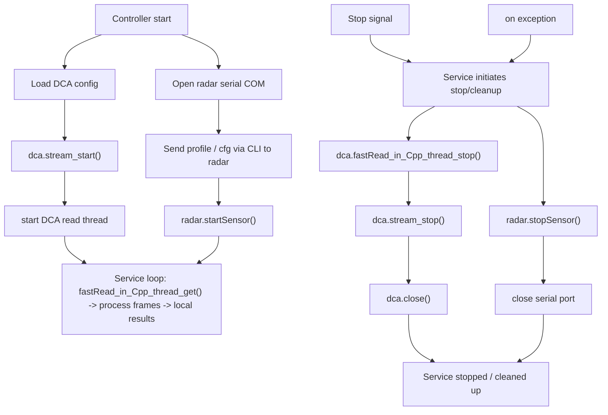

# DCA & Radar Service Flow (service-only)

Sơ đồ này mô tả luồng điều khiển khi chỉ chạy phần service (`realTimeProc`): cấu hình, khởi động, đọc dữ liệu và dọn dẹp cho `DCA1000` và radar.

Phiên bản này tối giản, rõ ràng và kiểm tra hợp lệ với Mermaid.
