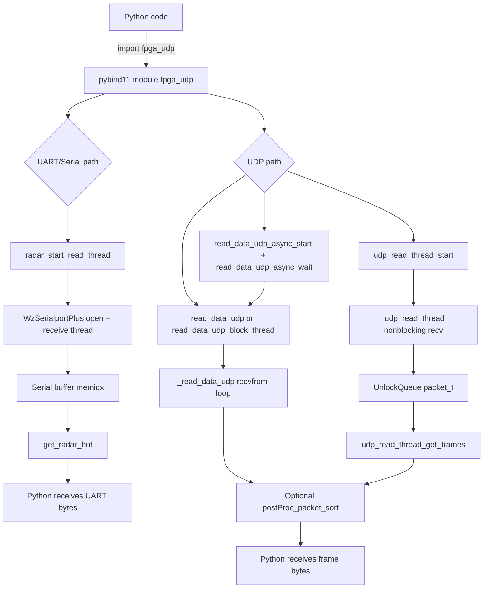

# fpga_udp main flow

```mermaid
flowchart TD
    A[Python code] -->|import fpga_udp| B[pybind11 module fpga_udp]

    B --> C{UART/Serial path}
    C --> C1[radar_start_read_thread]
    C1 --> C2[WzSerialportPlus open + receive thread]
    C2 --> C3[Serial buffer memidx]
    C3 --> C4[get_radar_buf]
    C4 --> C5[Python receives UART bytes]

    B --> D{UDP path}
    D --> D1[read_data_udp or read_data_udp_block_thread]
    D1 --> D2[_read_data_udp recvfrom loop]
    D2 --> D3[Optional postProc_packet_sort]
    D3 --> D4[Python receives frame bytes]

    D --> D5[read_data_udp_async_start + read_data_udp_async_wait]
    D5 --> D1

    D --> D6[udp_read_thread_start]
    D6 --> D7[_udp_read_thread nonblocking recv]
    D7 --> D8[UnlockQueue packet_t]
    D8 --> D9[udp_read_thread_get_frames]
    D9 --> D3
```
