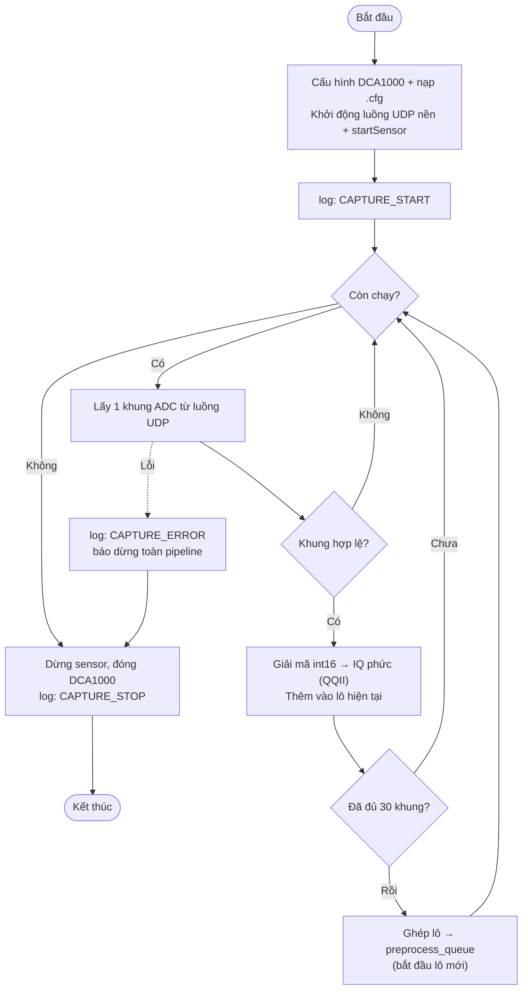

# P1 — capture_worker (Tiến trình thu nhận)

Nguồn: `realTimeProc_infer.py → capture_worker_process()`

**Nhiệm vụ:** cấu hình & khởi động AWR1843 + DCA1000, lấy từng khung ADC qua luồng UDP nền,
gom đủ một lô (30 khung) rồi đẩy sang P2 qua `preprocess_queue`.

**Điểm cần nhớ:**
- Đọc **từng khung một**, việc gom 30 khung thành lô diễn ra ở phía Python.
- `preprocess_queue` là hàng đợi **drop-oldest**: P2 chậm thì lô cũ bị bỏ để giữ dữ liệu mới.
- Lỗi thu nhận sẽ báo dừng đồng bộ cả ba tiến trình.
