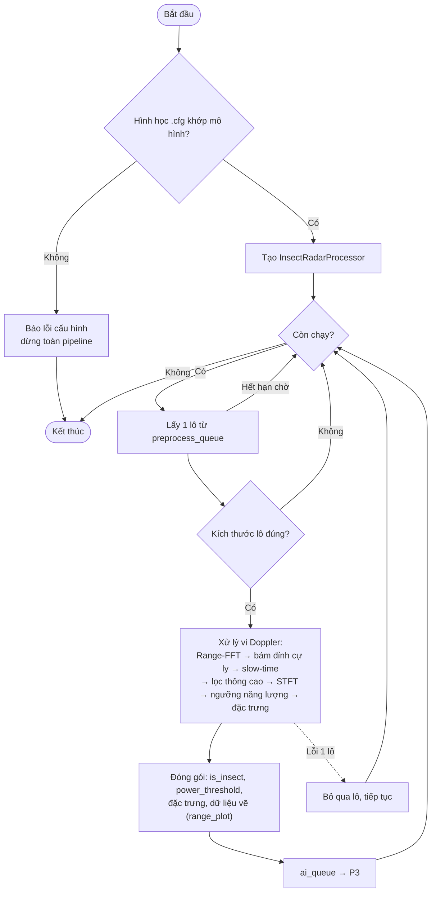

# P2 — preprocessing_worker (Tiến trình xử lý tín hiệu)

Nguồn: `realTimeProc_infer.py → preprocessing_worker_process()`
(DSP nằm trong `InsectRadarProcessor.process_complex`)

**Nhiệm vụ:** lấy từng lô từ P1, chạy chuỗi xử lý vi Doppler, trích đặc trưng,
rồi đẩy kết quả sang P3 qua `ai_queue`.

**Điểm cần nhớ:**
- Nếu `.cfg` không khớp hình học mô hình thì **dừng cả pipeline** ngay, tránh chạy sai âm thầm.
- Lô **nền** → không có đặc trưng (kèm `reason`); lô **côn trùng** → có đủ đặc trưng cho P3.
- Lỗi một lô chỉ bỏ qua lô đó (khác P1/P3 vốn dừng cả pipeline khi lỗi).
- `ai_queue` cũng là hàng đợi **drop-oldest**.
