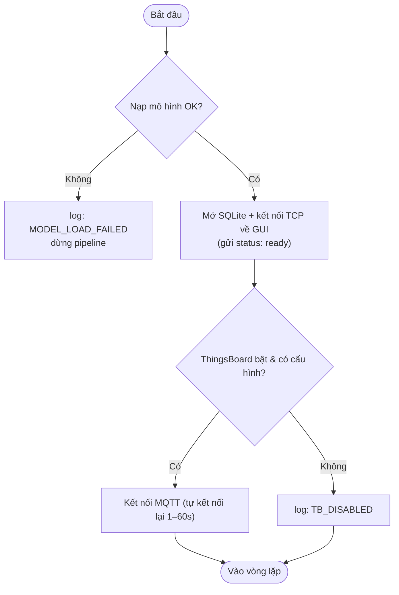
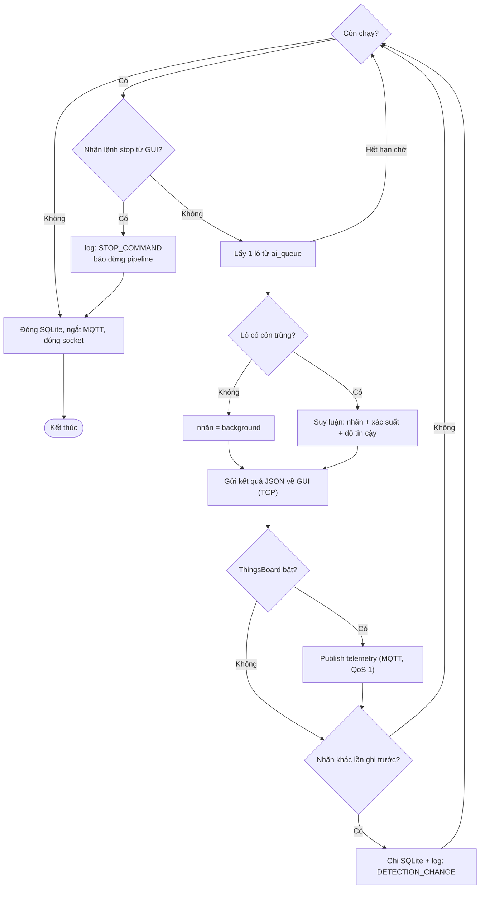

# P3 — ai_worker (Tiến trình suy luận)

Nguồn: `realTimeProc_infer.py → ai_worker_process()`

**Nhiệm vụ:** nạp mô hình một lần, suy luận nhãn cho mỗi lô, gửi kết quả về GUI (TCP),
đẩy telemetry lên ThingsBoard (MQTT) và ghi SQLite khi nhãn thay đổi.

## Khởi tạo

## Vòng lặp xử lý mỗi lô

**Điểm cần nhớ:**
- Mô hình nạp **một lần** trước vòng lặp; lỗi nạp → dừng pipeline.
- **GUI là server, P3 là client**; lệnh dừng đến từ GUI qua chính kết nối TCP đó.
- Telemetry đẩy **mỗi lô**; lỗi MQTT chỉ cảnh báo, không làm sập pipeline.
- SQLite **chỉ ghi khi nhãn thay đổi** (bỏ qua nhãn `error`) → cơ sở dữ liệu gọn, lưu mốc đổi loài.
