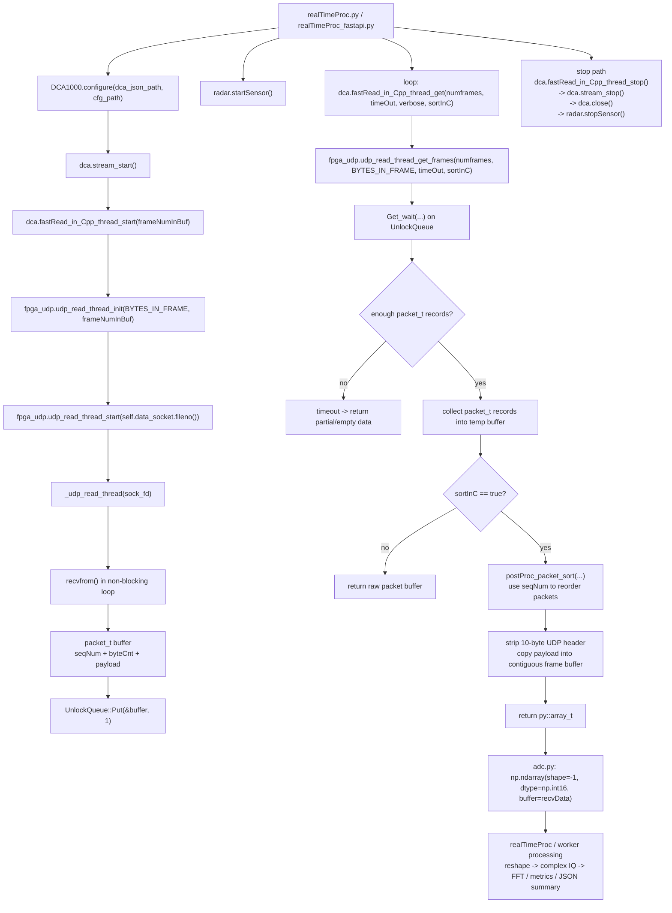

# Realtime raw data flow (thread_get path)

```mermaid
flowchart TD
    A["realTimeProc.py / realTimeProc_fastapi.py"] --> B["DCA1000.configure(dca_json_path, cfg_path)"]
    B --> C["dca.stream_start()"]
    C --> D["dca.fastRead_in_Cpp_thread_start(frameNumInBuf)"]
    D --> E["fpga_udp.udp_read_thread_init(BYTES_IN_FRAME, frameNumInBuf)"]
    E --> F["fpga_udp.udp_read_thread_start(self.data_socket.fileno())"]
    F --> G["_udp_read_thread(sock_fd)"]
    G --> H["recvfrom() in non-blocking loop"]
    H --> I["packet_t buffer\nseqNum + byteCnt + payload"]
    I --> J["UnlockQueue<packet_t>::Put(&buffer, 1)"]

    A --> K["radar.startSensor()"]

    A --> L["loop: dca.fastRead_in_Cpp_thread_get(numframes, timeOut, verbose, sortInC)"]
    L --> M["fpga_udp.udp_read_thread_get_frames(numframes, BYTES_IN_FRAME, timeOut, sortInC)"]
    M --> N["Get_wait(...) on UnlockQueue"]
    N --> O{"enough packet_t records?"}
    O -- "no" --> P["timeout -> return partial/empty data"]
    O -- "yes" --> Q["collect packet_t records into temp buffer"]
    Q --> R{"sortInC == true?"}
    R -- "no" --> S["return raw packet buffer"]
    R -- "yes" --> T["postProc_packet_sort(...)\nuse seqNum to reorder packets"]
    T --> U["strip 10-byte UDP header\ncopy payload into contiguous frame buffer"]
    U --> V["return py::array_t<uint8_t>"]

    V --> W["adc.py: np.ndarray(shape=-1, dtype=np.int16, buffer=recvData)"]
    W --> X["realTimeProc / worker processing\nreshape -> complex IQ -> FFT / metrics / JSON summary"]

    A --> Y["stop path\ndca.fastRead_in_Cpp_thread_stop()\n-> dca.stream_stop()\n-> dca.close()\n-> radar.stopSensor()"]
```
