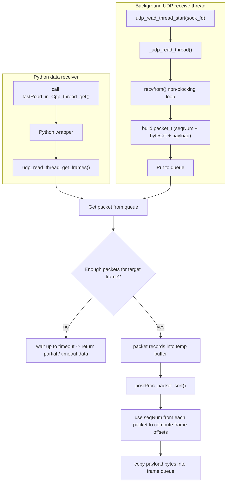

# Thread-get raw data flow (thread_get path)

Dưới đây là sơ đồ luồng nhận raw data bằng `thread_get` và cách dữ liệu được kéo ra, sắp xếp (sort) rồi đưa về Python.

File này là bản đơn giản, source Mermaid để bạn dễ chỉnh trực tiếp.

File này chỉ chứa source Mermaid để dễ chỉnh sửa hoặc dán vào công cụ hiển thị Mermaid.
